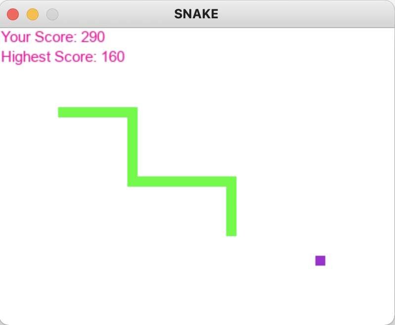

# Snake

Snake game in Python



## Purpose

The purpose of this project is create a version of the game Snake in Python

## Background

Snake is a video game concept in which the player moves around a line (the snake) which grows in length

## Gameplay

The player controls the snake's head on a bordered screen by using up, down, left, and right arrow keys. At the start of the game, the length of the snake is 1. A piece of food is randomly placed on the screen. The player moves the snake to the food to grow the snake in length. When a piece of food is consumed, the snake's tail increases by 1 square, and the score is increased. 

As the snake's head moves forward, its tail follows. The player loses when the snake runs into the screen border or itself.

## Built With

* [Python](https://www.python.org/) 3.7
* [Pygame](https://www.pygame.org/) 2.0.1

## Usage

### Install Requirements

* Install pygame
```
$ pip install pygame 2.0.1
```

### Run Script

* Run snake.py to run the game

```
$ python snake.py
```

## Author

**Laura Kocubinski** [laurakoco](https://github.com/laurakoco)

## Acknowledgments

* Boston University MET Master of Science Computer Science Program
* MET CS 521 Information Structures in Python

## References

[1] https://www.edureka.co/blog/snake-game-with-pygame/
